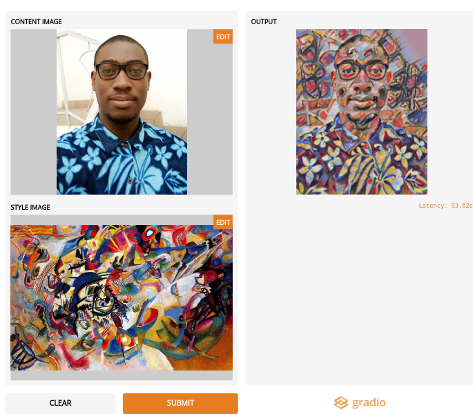

# Image Style Transfer
Une implémentation simple du Image Style Transfer avec TFHub magenta/arbitrary-image-stylization-v1-256

Le Style Transfer consiste à prendre deux image, une image de contenu et une image de style et les mélanger afin que la sortie ressemble à l'image de contenu mais peinte dans le style de l'image de style.

Je me suis basé sur le tutoriel de la documentation officielle de Tensorflow, j'ai juste repris le code et je l'ai intégré à Gradio.
Retrouvez la totalité du tutoriel ici [https://www.tensorflow.org/tutorials/generative/style_transfer](https://www.tensorflow.org/tutorials/generative/style_transfer)

**Gradio** est un module qui vous permet de créer rapidement des composants d'interface utilisateur personnalisables autour de vos modèles TensorFlow ou PyTorch, ou même des fonctions Python arbitraires. Mélangez et associez les composants pour prendre en charge toute combinaison d'entrées et de sorties..... https://gradio.app/

**Clôner le projet**

`git clone https://github.com/joekakone/style-transfer-gradio.git`

`cd style-transfer-gradio`

 
**Mise en place de l'environnement virtuel**

`virtualenv -p /usr/bin/python3 env`

`source env/bin/activate`

`pip install -r requirements.txt`

**Lancer le projet**

`python app.py`
